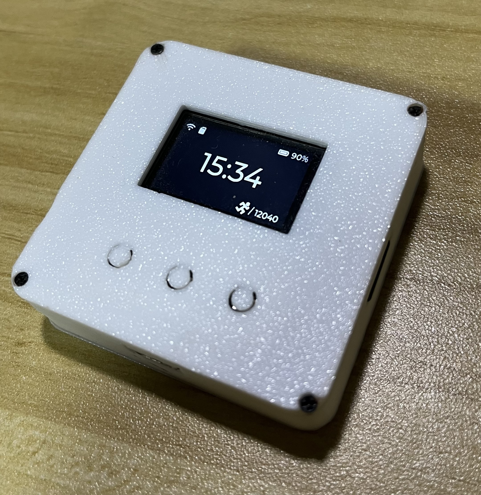
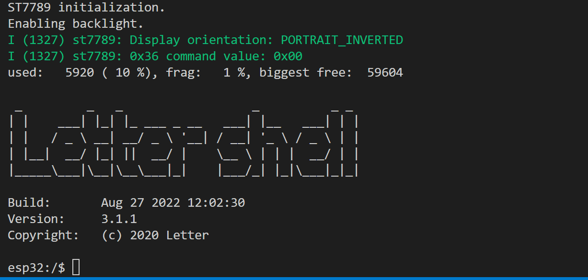

# GeekMotion

**功能描述：类似稚晖君Peak的小组件，手持嵌入式移动终端。**

- WIFI通信功能
- IMU、MAG传感器。
- 采用原生ESP-IDF开发，移植X-Track交互框架 + LVGL。
- LettleShell命令行模块，可以采用命令行和ESP32交互。
- 计步器
- 运动识别(待实现)
- 电梯识别(待实现)
- SD卡存储



命令行支持(移植letter shell)：



支持：

- 命令行自动补全
- 历史命令行记忆
- ...

**更新日志：**

**2022-08-23 ：** 1) 修改lettleSell部分函数，修改void为返回值为int, 减少由于函数指针转换造成的GCC Warning。2) 优化Page/SystemInfosModel.cpp，定义部分结构体后，采用memset函数初始化，减少GCC Warning。3）优化Page\StartUp部分宏定义、减少GCC Warning。 4）注释部分不使用函数，减少GCC Warning。

**2022-08-24 ：** 1）去掉visual studio的ARM和ARM64工程 2）隐藏LVGL在MSVC时产生的类型转换警告 3）加入CleanProject.bat脚本可以快速清理Visual Studio生成的pch和obj等临时文件。

**2022-08-27 ：**  1) 更新计步器功能 

**2022-08-28 :**    1）清除无用X-Track框架代码 2）移除Visual Studio x64工程只保留win32工程，最大程度复原Cotex-m 32位环境 

**lettleShell移植支持说明：** 需要适配esp32的ld文件。

样例：
C:\Users\Administrator\esp\esp-idf\components\esp32\ld\
在这个文件夹里面，把原来的esp32.project.ld.in替换当前目前的id文件，用于支持命令行，替换前记得备份

```c++
  /* 核心原理是找到这个.flash.appdesc, 然后加入_shell_command_start和*_shell_command_end/  
.flash.appdesc : ALIGN(0x10)
  {
    _rodata_start = ABSOLUTE(.);

    *(.rodata_desc .rodata_desc.*)               /* Should be the first.  App version info.        DO NOT PUT ANYTHING BEFORE IT! */
    *(.rodata_custom_desc .rodata_custom_desc.*) /* Should be the second. Custom app version info. DO NOT PUT ANYTHING BEFORE IT! */
	
	_shell_command_start = ABSOLUTE(.);
	KEEP (*(shellCommand))
	_shell_command_end = ABSOLUTE(.);

    /* Create an empty gap within this section. Thanks to this, the end of this
     * section will match .flah.rodata's begin address. Thus, both sections
     * will be merged when creating the final bin image. */
    . = ALIGN(ALIGNOF(.flash.rodata));
  } >default_rodata_seg
```

